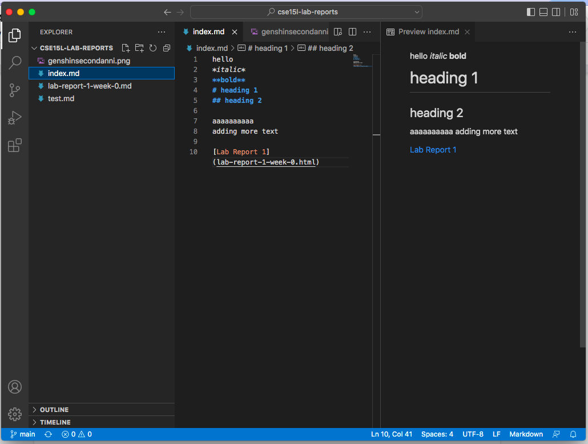
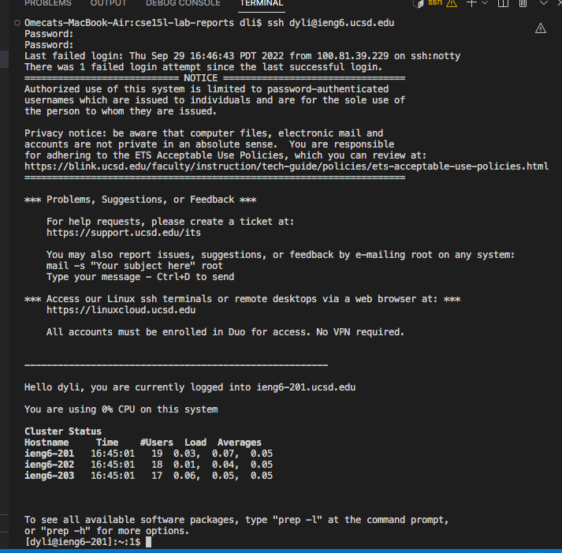
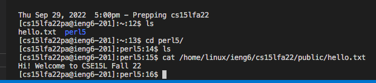
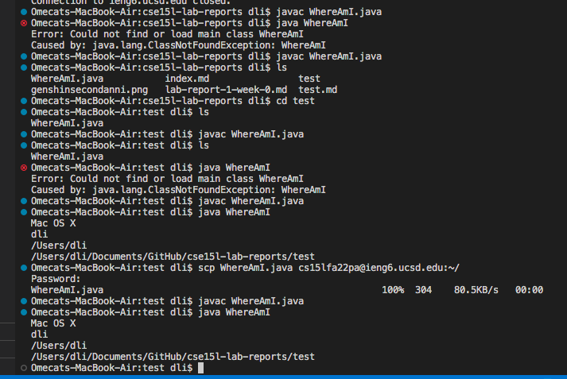
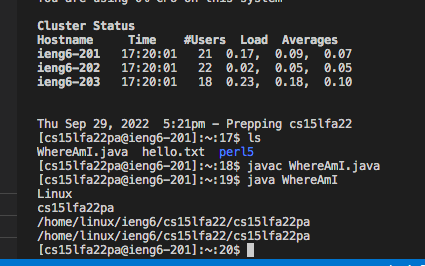
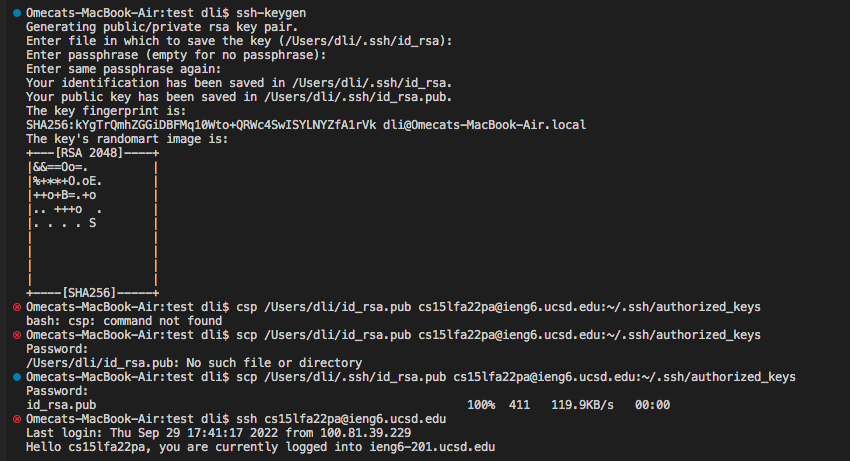
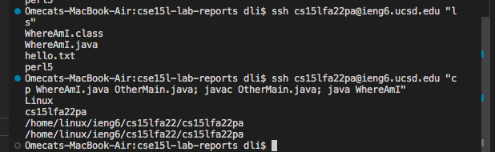

# 1. Installing VScode

Go to the [Visual Studio Code](https://code.visualstudio.com/) website to install VScode for your operating system.

Once installed, you should be able to open the application. (it should look something like this but it won't have any files)

# 2. Remotely Connecting
Go to [this website](https://sdacs.ucsd.edu/~icc/index.php) to find your CSE 15L account name. The first nine characters should be cs15lfa22 and the last two letters are unique to each user.

Then, [reset your password](https://docs.google.com/document/d/1hs7CyQeh-MdUfM9uv99i8tqfneos6Y8bDU0uhn1wqho/edit) by following these instructions.

Once the previous two steps have been completed, you should be able to remotely connect to your account through the VScode terminal by running "ssh [your username]" and entering your password.

Once you have remotely connected, the terminal should display something similar to the image below.

# 3. Trying Some Commands
Once remotely connected, you can run some basic commands from the terminal, for example "ls", "cd", etc. (you can look up other commands)

# 4. Moving Files with SCP
One easy way to tell if you have copied a file to the remote system is a java file that runs some commands that give information about the system it is located on. Create a file named WhereAmI.java on your client and paste this code into it:

    class WhereAmI {
        public static void main(String[] args) {
        System.out.println(System.getProperty("os.name"));
        System.out.println(System.getProperty("user.name"));
        System.out.println(System.getProperty("user.home"));
        System.out.println(System.getProperty("user.dir"));
        }
    }
Afterwards, locally run "javac WhereAmI.java" and "java WhereAmI". You should get an output that shows you your operating system, your username, and the location of WhereAmI.java on your system.

Now, log onto the remote system. Run the same two commands in the previous step and it should output the information of the remote system like this.

# 5. Setting an SSH Key
Next, you can run the command "ssh-keygen" to generate a public/private rsa key pair. One copy of this key will be saved locally and one will be saved on the remote system. This key serves as a fingerprint so that you don't have to re enter your password everytime you want to log onto the remote server.

See screenshot for specifics on what commands to run.

# 6. Optimising Remote Running
Lastly, you can now run commands on the remote system directly from your local system. in order to do this, run your commands in this format:

    $ ssh cs15lfa22@ieng6.ucsd.edu "[put your command here, or multiple commands separated by commas]"

